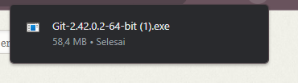
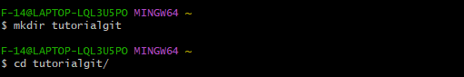

# Tutorial Penggunaan Git

Ini adalah tutorial penggunaan Git. Git adalah sistem kontrol versi yang kuat yang digunakan untuk mengelola perubahan dalam kode sumber.

## Instalasi Git

1. Unduh Git dari [https://git-scm.com/downloads](https://git-scm.com/downloads).
2. Ikuti panduan instalasi yang sesuai dengan sistem operasi Anda.


## Langkah-Langkah Dasar

1. **Inisialisasi Repositori Git**:
   - Buka terminal atau command prompt.
   - Buat direktori proyek Anda.
   - Masuk ke direktori proyek.
   - Inisialisasi repositori Git dengan perintah:
    
    ```markdown
    $ git init
    ```

2. **Menambahkan File**:
   - Tambahkan folder atau direktori ke repositori dengan perintah:
    
    ```markdown
    $ mkdir tutorialgit
  
    ```
  Te
3. **Membuat Commit**:
   - Buat commit untuk menyimpan perubahan dengan pesan deskriptif:
     
    ```markdown
    $ git commit -m "Pesan commit Anda di sini"
    ```

4. **Tautkan ke Repositori Eksternal (Opsional)**:
   - Tautkan repositori lokal Anda ke repositori di layanan eksternal seperti GitHub:
    
    ```markdown
    $ git remote add origin URL-repositori-Anda
    ```

5. **Mengirim Perubahan (Opsional)**:
   - Kirim perubahan Anda ke repositori eksternal (misalnya, GitHub) dengan perintah:
    
    ```markdown
    $ git push -u origin master
    ```

## Manajemen Cabang

Git memungkinkan Anda untuk membuat dan mengelola cabang dalam repositori Anda. Ini berguna untuk pengembangan fitur terpisah, pemecahan masalah, dan kerja kolaboratif. Berikut adalah beberapa perintah umum yang digunakan dalam manajemen cabang:

6. **Membuat Cabang Baru**:
   - Untuk membuat cabang baru dalam repositori Anda, gunakan perintah:
   
    ```markdown
    $ git branch nama-cabang
    ```

7. **Beralih ke Cabang Lain**:
   - Anda dapat beralih ke cabang lain dengan perintah:
   
    ```markdown
    $ git checkout nama-cabang
    ```

8. **Menggabungkan Cabang**:
   - Untuk menggabungkan perubahan dari satu cabang ke cabang lain, gunakan perintah:
   
    ```markdown
    $ git merge nama-cabang
    ```

## Kolaborasi dengan Git

Git juga sangat berguna untuk bekerja secara kolaboratif dengan orang lain dalam proyek perangkat lunak. Berikut adalah beberapa konsep dan perintah yang membantu dalam kolaborasi:

9. **Kloning Repositori**:
   - Anda dapat mengkloning repositori yang ada dengan perintah:
   
    ```markdown
    $ git clone URL-repositori
    ```

10. **Pengiriman Permintaan Tarik (Pull Request)**:
    - Saat bekerja di repositori bersama seperti GitHub, Anda dapat mengirim permintaan tarik untuk mengusulkan perubahan ke pemilik repositori utama.

11. **Konflik Penggabungan (Merge Conflict)**:
    - Terkadang, saat menggabungkan perubahan, Anda dapat mengalami konflik penggabungan. Anda perlu memecahkan konflik ini sebelum melanjutkan.

12. **Pemeliharaan Cabang**:
    - Pastikan untuk merawat cabang Anda dan menjaga sinkronisasi dengan cabang utama.

## Catatan Tambahan

- Pastikan untuk memahami konsep dasar seperti commit, cabang (branch), dan penggabungan (merge).
- Anda juga dapat membuat file `.gitignore` untuk mengabaikan file yang tidak perlu dilacak oleh Git.

## Sumber Daya Lanjutan

Git adalah alat yang kuat, dan Anda dapat mengeksplorasi lebih banyak tentangnya. Di sini adalah beberapa sumber daya lanjutan yang dapat membantu Anda:

- [Dokumentasi Resmi Git](https://git-scm.com/doc)
- [GitHub Learning Lab](https://lab.github.com/)
- [Atlassian Git Tutorial](https://www.atlassian.com/git)
- [Pro Git Book](https://git-scm.com/book/en/v2)

## Mengatasi Masalah Umum

13. **Lupa Kata Sandi Git**:
    - Jika Anda lupa kata sandi Git Anda, Anda dapat meresetnya dengan perintah:
   
    ```markdown
    $ git credential reject
    ```

14. **Mengatasi Error Git**:
    - Jika Anda menghadapi kesalahan Git, pastikan untuk memeriksa pesan kesalahan dan mencari solusi secara online.

Terima kasih telah mengikuti tutorial ini. Jika Anda memiliki pertanyaan atau membutuhkan bantuan lebih lanjut, jangan ragu untuk bertanya.
